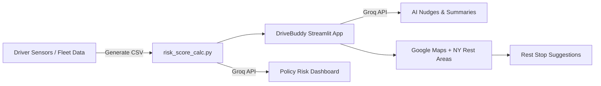

# 🚦 Next-Gen Usage-Based Insurance: Context-Aware, Lifestyle-Linked Insurance
 
### 🔍 Overview

This prototype is an AI-driven smart driving alert and insurance risk analytics system that integrates **real-time telematics**, **Groq-powered AI insights**, and **Streamlit visualization**.
It consists of two primary modules:

1. **DriveBuddy App** — Real-time driver monitoring and motivational nudges.
2. **Policy Risk Dashboard** — AI-based insurance premium analysis using telematics and policy data.

---

## 🧩 Features

### 🚘 **DriveBuddy – Smart Driving Assistant**

* Real-time monitoring of driver **risk**, **stress**, and **fatigue** levels.
* AI-generated **motivational nudges** using Groq’s `llama-3.1-8b-instant` model.
* Integration with **NY Rest Area API** to suggest nearby rest stops when stress is high.
* **Text-to-Speech (gTTS)** feedback for audible driver alerts.
* Auto-refreshing dashboard that cycles through driver data every 30 seconds.
* Visual event badges (overspeeding, harsh braking, fatigue, etc.).
* Live **Google Maps route** suggestions for rest area navigation.

### 📊 **Policy Risk Dashboard – Insurance Analytics**

* Reads `PolicyTransactions.csv` and `fleet_context_fusion.csv` for analysis.
* Generates CSV data dynamically using `risk_score_calc.generate_csv()`.
* AI-driven risk summarization and **premium recalculation** using Groq.
* Generates:

  * Risk trend summaries
  * Anomalies and causes
  * Premium recalculation tables with step-by-step explanations
  * Personalized AI commentary for driver behavior
* Dynamic **Plotly charts** for visual trend analysis.
* Fully interactive Streamlit layout with sidebars and expandable sections.

---

## 🧠 **AI Models & Logic**

### **Groq LLM (llama-3.1-8b-instant)**

* Used for both:

  * **Driving Nudges:** Friendly, motivational, and context-aware driving messages.
  * **Risk & Premium Analysis:** Structured and explainable insurance insights.
* Temperature set between `0.2–0.4` for balanced creativity and factual tone.

### **Few-Shot Prompting**

* Predefined examples guide tone and format of AI nudges.
* Each AI call dynamically builds on real-time sensor data (risk score, stress, GPS).

---

## 🧮 **Data Sources**

| Data File                  | Purpose                | Description                                                                         |
| -------------------------- | ---------------------- | ----------------------------------------------------------------------------------- |
| `fleet_context_fusion.csv` | Driver telematics      | Includes driver metrics like risk_score, stress_level, fatigue, GPS, and event tags |
| `PolicyTransactions.csv`   | Insurance transactions | Includes policy number, coverage codes, premium amounts, and transaction type       |
| `risk_score_calc.py`       | CSV Generator          | Dynamically produces or updates fleet telematics data for testing                   |

External API:

* **NY Rest Area Data:** [https://data.ny.gov/resource/qebf-4fd8.json](https://data.ny.gov/resource/qebf-4fd8.json)

---

## 🏗️ **System Architecture**

---

## 🧰 **Dependencies**

| Library                 | Purpose                                        |
| ----------------------- | ---------------------------------------------- |
| `streamlit`             | Web app interface                              |
| `pandas`                | Data handling                                  |
| `plotly`                | Interactive charts                             |
| `geopy`                 | Distance and location-based calculations       |
| `gtts`                  | Text-to-speech alerts                          |
| `groq`                  | LLM integration                                |
| `streamlit_autorefresh` | Auto-update Streamlit app                      |
| `pyodbc`                | Optional DB access for enterprise integrations |

---

## 🔊 **Example Outputs**

### ✅ AI Nudge Example

> “Vehicle V2: ⚠️ High risk detected! Drive very carefully in rainy city conditions.”

### 📈 Risk Summary Example

> “Driver shows a moderate increase in risk score due to frequent harsh braking events.
> Suggested premium adjustment: +10% Risk, +20% Event, +15% Stress — Final +45%.”

---

## 🛡️ **Ethical & Compliance Notes**

* Prototype demonstrates AI capabilities for telematics-based driver coaching.
* Future enhancements include:

  * Bias detection and explainability
  * Data anonymization
  * GDPR & IRDAI compliance

---

